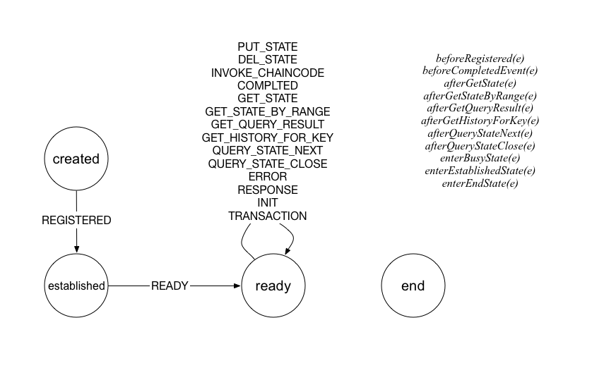

### handler.go

#### Handler 结构
Handler 结构，负责 Peer 响应 chaincode 容器过来的各种消息。

```go
type Handler struct {
	sync.RWMutex
	//peer to shim grpc serializer. User only in serialSend
	serialLock  sync.Mutex
	ChatStream  ccintf.ChaincodeStream
	FSM         *fsm.FSM
	ChaincodeID *pb.ChaincodeID
	ccInstance  *sysccprovider.ChaincodeInstance

	chaincodeSupport *ChaincodeSupport
	registered       bool
	readyNotify      chan bool
	// Map of tx txid to either invoke tx. Each tx will be
	// added prior to execute and remove when done execute
	txCtxs map[string]*transactionContext

	txidMap map[string]bool

	// used to do Send after making sure the state transition is complete
	nextState chan *nextStateInfo

	policyChecker policy.PolicyChecker
}
```

chaincode 容器启动后，会调用到服务端的 Register() 方法，该方法进一步调用到 HandleChaincodeStream()

```go
// HandleChaincodeStream Main loop for handling the associated Chaincode stream
func HandleChaincodeStream(chaincodeSupport *ChaincodeSupport, ctxt context.Context, stream ccintf.ChaincodeStream) error {
	deadline, ok := ctxt.Deadline()
	chaincodeLogger.Debugf("Current context deadline = %s, ok = %v", deadline, ok)
	handler := newChaincodeSupportHandler(chaincodeSupport, stream)
	return handler.processStream()
}
```

newChaincodeSupportHandler 方法中会初始化 FSM。

之后，调用 handler.processStream() 进入对来自 chaincode 容器消息处理的主循环。


#### FSM




下面是 FSM 可能会触发的方法，每个方法首先都会从 e.Args[0] 尝试解析 ChaincodeMessage 结构，如果失败则退出，成功则继续。

* beforeRegisterEvent：收到来自链码容器的 ChaincodeMessage_REGISTER 注册消息，注册到本地的一个 handler 结构，返回 ChaincodeMessage_REGISTERED 消息给链码容器。