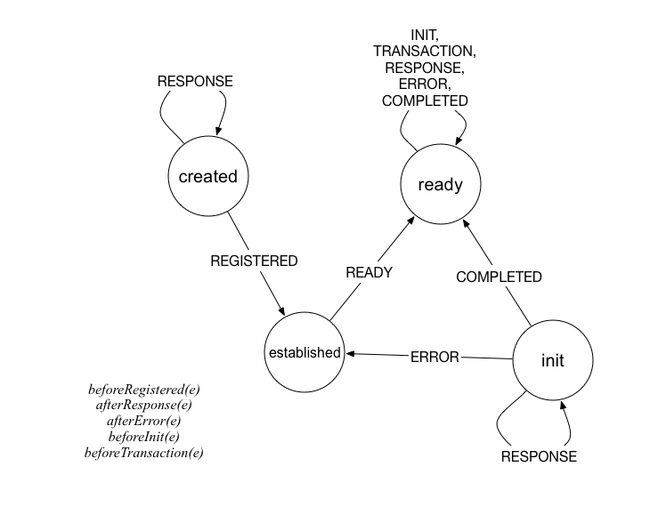

#### handler.go

最主要的是实现了 Handler 结构体，通过各种 handleXXX 方法具体实现来自 Chaincode 接口中定义的的各种对账本的操作。

```go
type Handler struct {
	sync.RWMutex
	//shim to peer grpc serializer. User only in serialSend
	serialLock sync.Mutex
	To         string
	ChatStream PeerChaincodeStream
	FSM        *fsm.FSM
	cc         Chaincode
	// Multiple queries (and one transaction) with different txids can be executing in parallel for this chaincode
	// responseChannel is the channel on which responses are communicated by the shim to the chaincodeStub.
	responseChannel map[string]chan pb.ChaincodeMessage
	nextState       chan *nextStateInfo
}
```

成员主要包括：

* ChatStream：跟 Peer 进行通信的 grpc 流。
* FSM：最重要的事件处理状态机，根据收到不同事件调用不同方法。
* cc：所面向的链码。
* responseChannel：本地 chan。字典结构，key 是 TxID，value 里面可以放上一些消息，供调用者后面使用。
* nextState：本地 chan，可以存放下一步要进行的操作和数据。

##### FSM



FSM 的初始化在 newChaincodeHandler() 方法中。

下面是 FSM 可能会触发的方法，每个方法首先都会从 e.Args[0] 尝试解析 ChaincodeMessage 结构，如果失败则退出，成功则继续。

* beforeRegistered(e)：收到了注册到 peer 成功的消息，不进行任何操作。
* afterResponse(e)：将消息放到 responseChannel 中。
* afterError(e)：将消息放到 responseChannel 中。
* beforeInit(e)：收到初始化请求 INIT 消息。解析消息后调用 Handler.handleInit()方法进行处理。该方法从消息 Payload 中解析出 ChaincodeInput 结构，利用这些信息，新建 stub 结构，并调用 stub.init 方法对 stub 进行初始化（配置 TxID、args、handler、signedProposal、creator、transient、binding 等成员）。之后，调用 Handler 结构成员 chaincode 结构的 Init 方法（由用户编写）。将收到的结果构造一个 COMPLETED ChaincodeMessage，放到 nextState 里面待发送。
* beforeTransaction(e)：收到发起交易的请求 TRANSACTION 消息。解析消息后调用 Handler.handleTransaction()方法进行处理。该方法从消息 Payload 中解析出 ChaincodeInput 结构，利用这些信息，新建 stub 结构，并调用 stub.init 方法对 stub 进行初始化（配置 TxID、args、handler、signedProposal、creator、transient、binding 等成员）。之后，调用 Handler 结构成员 chaincode 结构的 Invoke 方法（由用户编写）。将收到的结果构造一个 COMPLETED ChaincodeMessage，放到 nextState 里面待发送。


