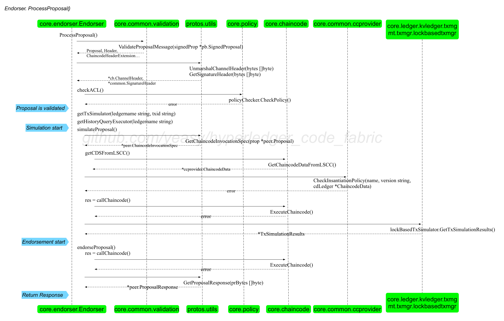

### endorser.go

提供 Endorser 结构体。

```go
// Endorser provides the Endorser service ProcessProposal
type Endorser struct {
    policyChecker policy.PolicyChecker
}
```

该结构体最关键的是提供了 `func (e *Endorser) ProcessProposal(ctx context.Context, signedProp *pb.SignedProposal) (*pb.ProposalResponse, error)` 方法，供客户端远程 grpc 调用。用来接受签名的交易提案（Signed Proposal），进行背书处理。

背书过程主要完成如下操作：

* 检查提案合法性；
* 模拟执行提案（启动链码容器，对世界状态的最新版本进行临时快照，基于它执行链码，结果记录在读写集中）；
* 对提案进行背书（对提案内容和读写集合进行签名），并返回提案响应消息。


#### ProcessProposal() 方法主要过程

主要过程如下图所示。



* 检查提案合法性；
    * 调用 ValidateProposalMessage() 方法对签名的提案进行格式检查，主要检查 Channel头（是否合法头部类型）、签名头（是否包括了 nonce和creators 数据），检查签名域（creator 是合法证书，签名是否正确）。
    * 如果是系统 CC（SCC），检查是否是允许从外部调用的三种 SCC 之一：cscc、lscc 或 qscc。
    * 如果 chainID 不为空，获取对应 chain 的账本结构，检查 TxID 的唯一性（交易在账本上没发生过）；
    * 对于用户 CC，检查 ACL。根据 chaincode 指定的 endorsement Policy，签名提案者在指定 channel 上有写权限，最终是调用 common/cauthdsl 下面代码，支持指定必须包括某个成员来签名，或者是凑够若干几个合法签名。
* 模拟执行提案
    * 如果 chainID 不为空，获取对应账本的交易模拟器（TxSimulator）和历史查询器（HistoryQueryExecutor），把 historyqueryexecutor 加入到 Context 的 K-V 储存中。
    * 如果 chainID 不为空，调用 simulateProposal() 方法获取模拟执行的结果，检查返回的响应 response的状态，若不小于错误 500 则创建并返回一个失败的 ProposalResponse。
* 对提案进行背书
    * chainID 非空情况下，调用 endorseProposal() 方法利用 ESCC，对之前得到的模拟执行的结果进行背书。返回 ProposalResponse，检查 simulateProposal 返回的response 的状态，若不小于错误阈值 400（被背书节点反对），返回 ProposalResponse 及链码错误 chaincodeError（endorseProposal 里有检查链码执行结果的状态，而 simulateProposal 没有检查）。
    * 将 response.Payload 赋给 ProposalResponse.Response.Payload（因为 simulateProposal 返回的 response 里面包含链码调用的结果）。
    * 返回响应消息 ProposalResponse。


#### simulateProposal 方法

主要过程如下：

* 从提案结构中提取 ChaincodeInvocationSpec，里面包含了所调用链码的路径、名称和版本，以及调用时传入的各种参数；
* 检查 ESCC 和 VSCC（这里其实不需要）；
* 对用户链码，检查提案中的实例化 Policy 是否跟 LSCC 得到的实例化 Policy 匹配。防止有人超出权限在其它通道实例化。
* 调用 callChaincode() 方法执行 Proposal，返回 response 和 ccevent。
    * 调用 ExecuteChaincode() 方法，该方法主要调用 Execute() 方法。调用过程中会把交易模拟器和历史查询器通过上下文结构体传入后续子方法。
    * Execute() 方法调用 theChaincodeSupport.Launch() 方法启动链码容器。Launch() 方法会创建 CC 容器并启动。
    * Execute() 方法进一步调用 theChaincodeSupport.Execute() 方法发送消息给 CC 容器，执行相关的合约。
* 对  transactionSimulator 执行 GetTxSimulationResults()拿到交易读写集 simResult。
* 返回链码数据 ChaincodeData（LSCC 中的）、响应 response、交易读写集 simResult、链码事件信息 ccevent。

#### endorseProposal 方法

主要过程如下：

* 获取被调用的链码指定的背书链码的名字。
* 通过 callChaincode() 实现对背书链码的调用，返回响应 response（对 ESCC 的调用同样也会产生 simulation results，但 ESCC 不能背书自己产生的simulation results，需要背书最初被调用的链码产生的 simulation results）。
* 检查 response.Status，是否大于等于 400（错误阈值），若是则把 response 赋给 proposalResponse.Response 并返回 proposalResponse。
* 将 response.Payload解码后（ProposalResponse类型）返回。

#### callChaincode 方法

主要过程如下：

* 判断交易模拟器，不为空则把它加入到Context的K-V存储中。
* 判断被call的cc是不是系统链码，创建CCContext（包含通道名、链码名、版本号、交易ID、是否 SCC、签名 Prop、Prop）
* 调用 core/chaincode/chaincodeexec.go 下的 ExecuteChaincode()，返回响应 response 和 事件ccevent。
* 返回 response和ccevent。


