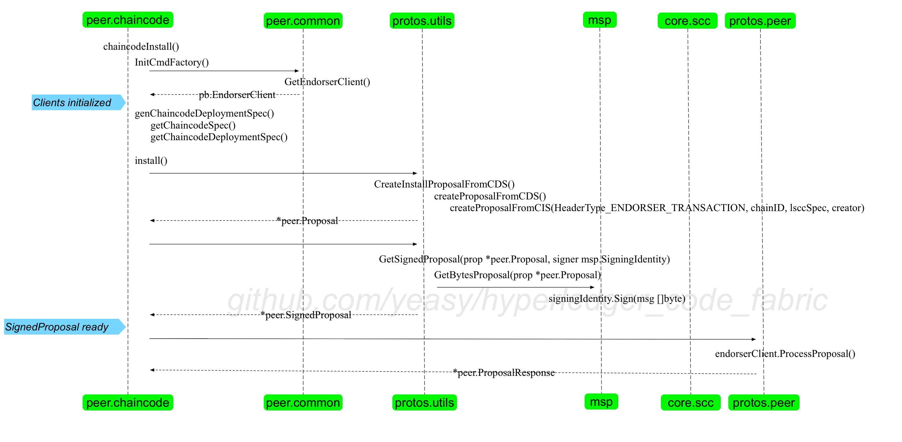
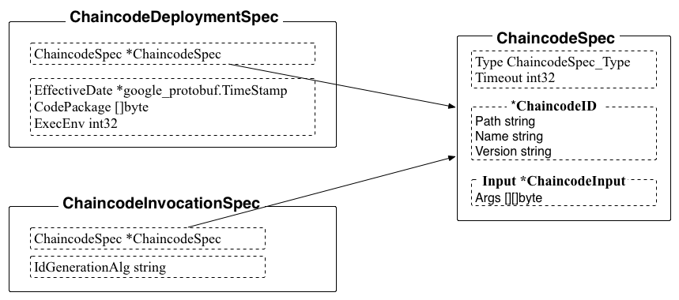

### install.go
响应 `peer chaincode install` 命令，将智能合约源码和环境传输到指定的 peer 节点上，并生成智能合约的部署打包文件（name.version）到默认的 `/var/hyperledger/production/chaincodes/` 目录下。

例如

```bash
peer chaincode install -n test_cc -p github.com/hyperledger/fabric/examples/chaincode/go/chaincode_example02 -v 1.0
```

命令调用 chaincodeInstall 方法。

一种是通用的方式，通过传入的参数进行打包；一种是直接读入传入的打包文件 ccpackfile 进行处理。

整体流程如下：

* 首先会调用 InitCmdFactory，初始化 Endosermentclient、Signer 等结构。这一步对于所有 chaincode 子命令来说都是类似的，个别会初始化不同的结构。
* 调用 chaincodeInstall 方法，解析命令行参数，生成 ChaincodeSpec；
* 根据 CS，结合 chaincode 相关数据生成一个 ChaincodeDeploymentSpec（CDS）结构（chainID 为空），并传入 install 方法；
* install 方法基于传入的 CDS，生成一个 install 类型的 Proposal，进行签名和转化为一个 protobuf 提案消息；
* 通过 EndorserClient 经由 grpc 通道发送给 peer 进行背书。

整体流程如下图所示。




#### 生成 ChaincodeDeploymentSpec 结构



其中，ChaincodeDeploymentSpec 结构的 CodePackage 变量包括所调用的 chaincode 的代码和所需要的环境代码（例如整个 $GOPATH/src 目录下数据），为 tar 格式的二进制数据。

#### 进行 endorsement
调用 install 方法，根据 CDS 来生成 Install Proposal。

首先，从本地 MSP 中拿到签名体身份（签名体在初始化阶段完成导入，包括证书和私钥）。

首先，创建 Install Proposal。

```golang
prop, _, err := utils.CreateInstallProposalFromCDS(msg, creator)
```

实际调用的是 protos/utils/proputils.go 中的 createProposalFromCDS 方法，创建一个对 LSCC 的 ChaincodeInvocationSpec，然后基于它创建一个 Proposal 结构。在此期间，需要生成 transaction id（随机生成的 nonce 值和 creator 信息，一起进行摘要）。

Proposal 结构体内容被 cf.Signer 进行签名，生成 SignedProposal 消息。SignedProposal 通过 endorsement 客户端通过 grpc 发送到 peer 节点进行背书，正常会收到 ProposalResponse 消息。


