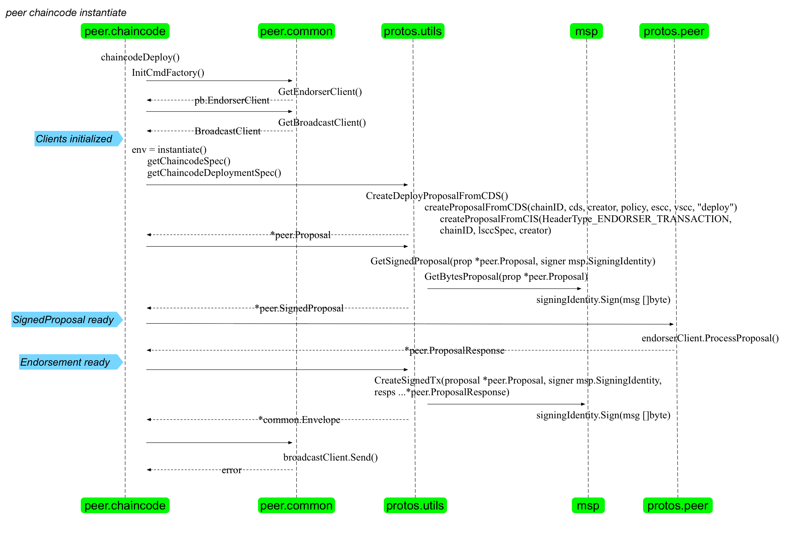

### instantiate.go
响应 `peer chaincode instantiate` 命令，生成智能合约容器，在 peer 节点上启动。

例如

```bash
peer chaincode instantiate -n test_cc -c '{"Args":["init","a","100","b","200"]}' -o orderer0:7050 -v 1.0
```

instantiate 支持包括 policy、channel、escc、vscc 在内更多的命令行参数。

命令调用 chaincodeDeploy 方法。

首先会调用 InitCmdFactory 方法，初始化 EndosermentClient、Signer、BroadcastClient 等结构。这一步对于所有 chaincode 子命令来说都是类似的，个别会初始化不同的结构。

之后，会调用 instantiate 方法，instantiate 方法的流程如下：

* 根据传入的各种参数，生成 ChaincodeSpec，注意 instantiate 和 upgrade 是支持 policy、escc、vscc 等参数。
* 生成 ChaincodeDeploymentSpec 结构。
* 根据 CDS、签名实体、策略、通道、escc、vscc 等信息，创建一个 LSCC 的 ChaincodeInvocationSpec，根据这个 CIS，添加上 TxID（随机数+签名实体，进行 hash），创建一个 Proposal 出来。
* 根据签名实体，对 Proposal 进行签名。
* 调用 EndorserClient，发送 gprc 消息，将签名后 Proposal 发给指定的 peer。
* 根据 peer 的返回，创建一个 Envelop 结构并进行签名。
* 将 Envelop 通过 grpc 通道发给 orderer。

整体流程如下图所示。


