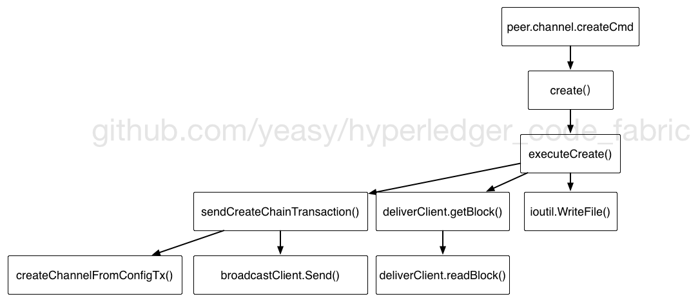

### create.go

`peer channel create` 命令的入口。

调用 create 方法，首先通过 InitCmdFactory 进行初始化，然后调用 executeCreate。

executeCreate 流程包括：

* 客户端调用 sendCreateChainTransaction，检查指定的配置交易文件，或者利用默认配置，构造一个创建应用通道的配置交易结构，封装为 Envelope，指定类型为 CONFIG_UPDATE。
* 客户端发送配置交易到 Orderer 服务。
* Orderer 收到 CONFIG_UPDATE 消息后，检查指定的通道还不存在，则开始新建过程，构造该应用通道的初始区块。
    * Orderer 首先检查通道应用（Application）配置中的组织都在创建的联盟（Consortium）配置组织中。
    * 之后从系统通道中获取 Orderer 相关的配置，并创建应用通道配置，对应 mod_policy 为系统通道配置中的联盟指定信息。
    * 接下来根据 CONFIG_UPDATE 消息的内容更新获取到的配置信息。所有配置发生变更后版本号都要更新。
    * 最后，发送到系统通道中，完成应用通道的创建过程。
* 客户端从 Orderer 获取到该应用通道的初始区块。
* 客户家将收到的区块写入到本地的 chainID + ".block" 文件。这个文件后续会被需要加入到通道的节点使用。

sendCreateChainTransaction 方法会检查，如果提供了 tx 文件了，则直接读取为 Envelope 结构；如果不存在，则通过默认值来创建一个 Envelope 结构。之后将 Envelope 结构发给 orderer。

Envelope 结构中 Payload.Data 是一个 ConfigUpdateEnvelope 结构。