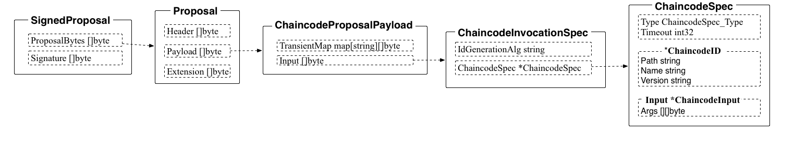

### join.go

join 过程也十分简单，主要是 peer 完成。

同样的，首先通过 InitCmdFactory 进行初始化。

* 客户端首先创建一个 ChaincodeSpec 结构，其 input 中的 Args 第一个参数是 CSCC.JoinChain（指定调用配置链码的操作），第二个参数为所加入通道的初始区块。
* 利用 CS 构造一个 ChaincodeInvocationSpec 结构。
* 利用 CIS，创建 Proposal 结构并进行签名，channel 头部类型为 CONFIG。
* 客户端通过 gRPC 将 Proposal 发给 Endorser，调用 ProcessProposal() 方法进行处理，主要通过配置系统链码进行本地链的初始化工作，并通过获取通道的配置来得到 Ordering 服务地址。
* 初始化完成后，即可收到来自通道内的 Gossip 消息等。