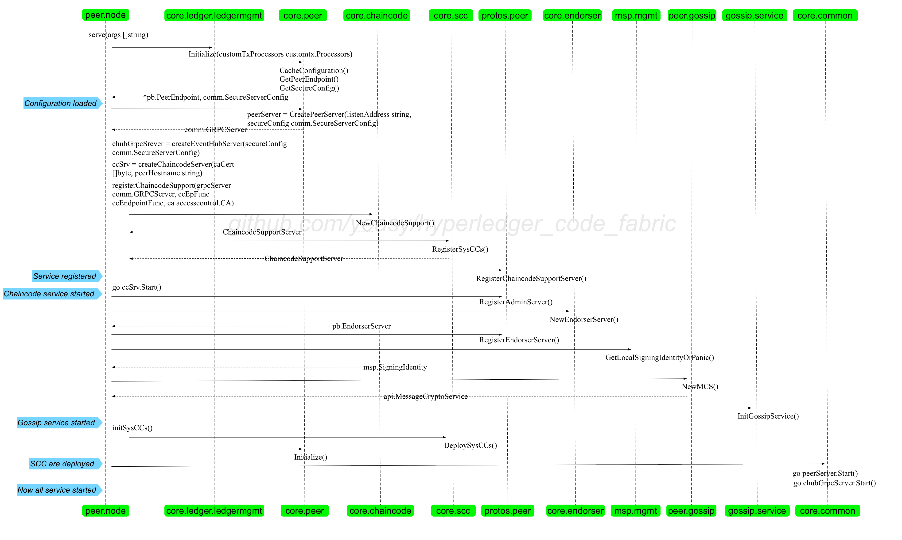

### start.go

负责 `peer node start` 命令。

最重要的是 `func serve(args []string) error` 函数，启动一个节点服务，主要是启动各个 GRPC 的服务端。包括 EventsServer 服务、chaincodesupport 服务、admin 服务、endorser 服务、gossip 服务。

* EventsServer 服务（events.producer.EventsServer）：提供 Chat GRPC 调用。
* ChaincodeSupport（core.chaincode.ChaincodeSupport）服务：提供 Execute、Launch、Register、Stop 等方法。
* ServerAdmin 服务（core.ServerAdmin）：提供 GetStatus、StartServer、StopServer、GetModuleLogLevel、SetModuleLogLevel 等方法。
* Endorser 服务（core.endorser.Endorser）：提供 ProcessProposal 方法。
* GossipService 服务（gossip.service.GossipService）：提供 NewConfigEventer、InitializeChannel、GetBlock、AddPayload 方法。

startCmd() 方法调用 serve() 方法。

整体流程如下图所示。



#### 配置读取和缓存
首先是进行配置管理，根据配置信息和一些计算来构建 cache 结构，探测节点信息等。主要调用 core.peer 包来实现。

```go
	if err := peer.CacheConfiguration(); err != nil {
		return err
	}

	peerEndpoint, err := peer.GetPeerEndpoint()
	if err != nil {
		err = fmt.Errorf("Failed to get Peer Endpoint: %s", err)
		return err
	}
```

#### 创建 eventHub 服务

eventHub 服务监听到 7053 端口，仅在 VP 节点上打开。

调用 `createEventHubServer` 方法实现，主要过程为：

创建 EventHub 服务，通过调用 createEventHubServer() 方法来实现，该服务也是 grpc，只有 vp 节点才开启。

```go
	lis, err = net.Listen("tcp", viper.GetString("peer.validator.events.address"))
	if err != nil {
		return nil, nil, fmt.Errorf("failed to listen: %v", err)
	}

	//TODO - do we need different SSL material for events ?
	var opts []grpc.ServerOption
	if comm.TLSEnabled() {
		creds, err := credentials.NewServerTLSFromFile(viper.GetString("peer.tls.cert.file"), viper.GetString("peer.tls.key.file"))
		if err != nil {
			return nil, nil, fmt.Errorf("Failed to generate credentials %v", err)
		}
		opts = []grpc.ServerOption{grpc.Creds(creds)}
	}

	grpcServer = grpc.NewServer(opts...)
	ehServer := producer.NewEventsServer(uint(viper.GetInt("peer.validator.events.buffersize")), viper.GetInt("peer.validator.events.timeout"))
	pb.RegisterEventsServer(grpcServer, ehServer)
```

eventHub 服务支持的方法为 Chat。

```golang
type EventsServer interface {
	// event chatting using Event
	Chat(Events_ChatServer) error
}
```

#### 创建和注册 grpc 服务
创建 gprc 服务，并注册上 chaincode、admin、endorser、gossip 等服务，并初始化注册 chainless 系统 chaincode 和创建初始区块。

```golang
grpcServer := grpc.NewServer(opts...)

registerChaincodeSupport(grpcServer)

logger.Debugf("Running peer")

// Register the Admin server
pb.RegisterAdminServer(grpcServer, core.NewAdminServer())

// Register the Endorser server
serverEndorser := endorser.NewEndorserServer()
pb.RegisterEndorserServer(grpcServer, serverEndorser)

// Initialize gossip component
bootstrap := viper.GetStringSlice("peer.gossip.bootstrap")
service.InitGossipService(peerEndpoint.Address, grpcServer, bootstrap...)
defer service.GetGossipService().Stop()
```

其中，chaincode 服务支持方法为

```golang
type ChaincodeSupportServer interface {
	Register(ChaincodeSupport_RegisterServer) error
}
```

admin 服务支持方法为

```golang
type AdminServer interface {
	// Return the serve status.
	GetStatus(context.Context, *google_protobuf1.Empty) (*ServerStatus, error)
	StartServer(context.Context, *google_protobuf1.Empty) (*ServerStatus, error)
	StopServer(context.Context, *google_protobuf1.Empty) (*ServerStatus, error)
	GetModuleLogLevel(context.Context, *LogLevelRequest) (*LogLevelResponse, error)
	SetModuleLogLevel(context.Context, *LogLevelRequest) (*LogLevelResponse, error)
}
```

endorser 服务支持方法为

```golang
type EndorserServer interface {
	ProcessProposal(context.Context, *SignedProposal) (*ProposalResponse, error)
}
```

gossip 服务支持方法为

```golang
type GossipServer interface {
	// GossipStream is the gRPC stream used for sending and receiving messages
	GossipStream(Gossip_GossipStreamServer) error
	// Ping is used to probe a remote peer's aliveness
	Ping(context.Context, *Empty) (*Empty, error)
}
```

#### 启动 grpc 服务和 eventHub 服务
之后是启动 grpc 服务，监听到 7051 端口。

```go
go func() {
		var grpcErr error
		if grpcErr = grpcServer.Serve(lis); grpcErr != nil {
			grpcErr = fmt.Errorf("grpc server exited with error: %s", grpcErr)
		} else {
			logger.Info("grpc server exited")
		}
		serve <- grpcErr
	}()
```

启动 eventHub 服务。

```go
if ehubGrpcServer != nil && ehubLis != nil {
		go ehubGrpcServer.Serve(ehubLis)
	}
```

最后，如果需要 profiling，还会打开监听服务。