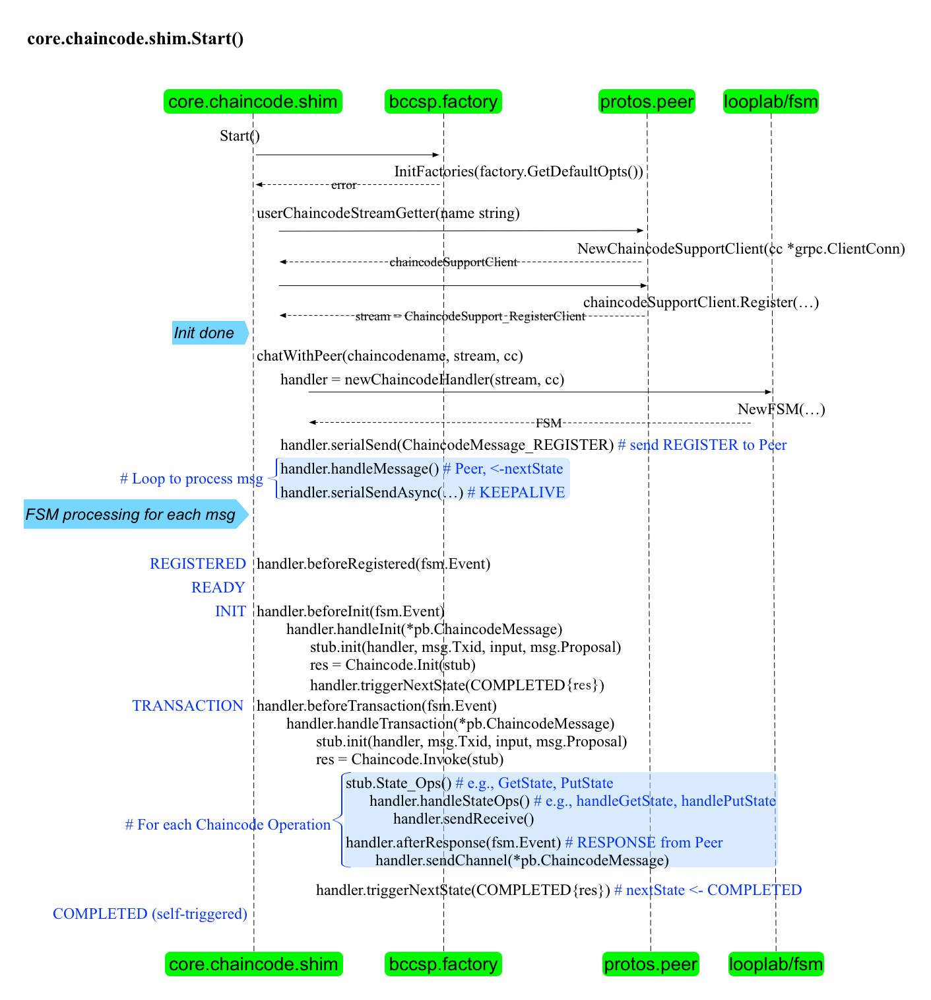

## Chaincode 启动过程

### 简介

这里讲的 Chaincode 是用户链码（User Chaincode，UCC），对应用开发者来说十分重要，它提供了基于区块链分布式账本的状态处理逻辑，基于它可以开发出多种复杂的应用。

Hyperledger Fabric 中，Chaincode 默认运行在 Docker 容器中。Peer 通过调用 Docker API 来创建和启动 Chaincode 容器。Chaincode 容器启动后跟 Peer 之间创建 gRPC 连接，双方通过发送 ChaincodeMessage 来进行交互通信。Chaincode 容器利用 core.chaincode.shim 包提供的接口来向 Peer 发起请求。

### 典型结构

下面给出了链码的典型结构，用户只需要关注到 Init() 和 Invoke() 函数的实现上，在其中利用 shim.ChaincodeStubInterface 结构，实现跟账本的交互逻辑。

```go
package main

import (
	"errors"
	"fmt"
	"github.com/hyperledger/fabric/core/chaincode/shim"
)

type DemoChaincode struct { }

func (t *DemoChaincode) Init(stub shim.ChaincodeStubInterface) pb.Response {
	// more logics using stub here
	return stub.Success(nil)
}

func (t *DemoChaincode) Invoke(stub shim.ChaincodeStubInterface) pb.Response
	// more logics using stub here
	return stub.Success(nil)
}

func main() {
	err := shim.Start(new(DemoChaincode))
	if err != nil {
		fmt.Printf("Error starting DemoChaincode: %s", err)
	}
}
```

### 启动过程

Chaincode 首先是一个普通的 Golang 程序，其 main 方法中调用了 shim 层的 Start() 方法。整体启动过程如下图所示。




首先会进行初始化。包括读取默认配置，创建到 Peer 的gRPC 连接，主要包括 NewChaincodeSupportClient(cc *grpc.ClientConn) 和 chaincodeSupportClient.Register(ctx context.Context, opts ...grpc.CallOption) 两个方法。

初始化完成后，创建有限状态机结构（FSM，github.com/looplab/fsm）。FSM 会根据收到的消息和当前状态来触发状态转移，并执行提前设置的操作。

*Peer 侧也利用了类似的 FSM 结构来管理消息响应。*

之后，利用创建好的 gRPC 连接开始向 Peer 发送第一个 gRPC 消息：ChaincodeMessage_REGISTER，将自身注册到 Peer 上。注册成功后开始消息处理循环，等待接收来自 Peer 的消息以及自身的状态迁移（nextState）消息。

后续过程中，Chaincode 和 Peer 利用 FSM 完成一系列对消息的响应运作，如下所示。

* Peer 收到来自链码容器的 ChaincodeMessage_REGISTER 消息，将其注册到本地的一个 Handler 结构，返回 ChaincodeMessage_REGISTERED 消息发给链码容器。之后更新状态为 established ，并发送 ChaincodeMessage_READY 消息给链码侧，更新状态为 ready。
* 链码侧收到 ChaincodeMessage_REGISTERED 消息后，不进行任何操作，注册成功。更新状态为 established。收到 ChaincodeMessage_READY 消息后更新状态为 ready。
* Peer 侧发出 ChaincodeMessage_INIT 消息给链码容器，准备触发链码侧初始化操作。
* 链码容器收到 ChaincodeMessage_INIT 消息，通过 Handler.handleInit() 方法进行进行初始化。主要包括初始化所需的 ChaincodeStub 结构，以及调用链码代码中的 Init() 方法。初始化成功后，返回 ChaincodeMessage_COMPLETED 消息给 Peer。此时，链码容器进入可被调用（Invoke）状态。
* 链码被调用时，Peer 发出 ChaincodeMessage_TRANSACTION 消息给链码。
* 链码收到 ChaincodeMessage_TRANSACTION 消息，会调用 Invoke() 方法，根据 Invoke 方法中用户实现的逻辑，可以发出包括 ChaincodeMessage_GET_HISTORY_FOR_KEY、ChaincodeMessage_GET_QUERY_RESULT、ChaincodeMessage_GET_STATE、ChaincodeMessage_GET_STATE_BY_RANGE、ChaincodeMessage_QUERY_STATE_CLOSE、ChaincodeMessage_QUERY_STATE_NEXT、ChaincodeMessage_INVOKE_CHAINCODE 等消息给 Peer 侧。Peer 侧收到这些消息，进行相应的处理，并回复 ChaincodeMessage_RESPONSE 消息。最后，链码侧会回复调用完成的消息 ChaincodeMessage_COMPLETE 给 Peer 侧。
* 在上述过程中，Peer 和链码侧还会定期的发送 ChaincodeMessage_KEEPALIVE 消息给对方，以确保彼此在线。

