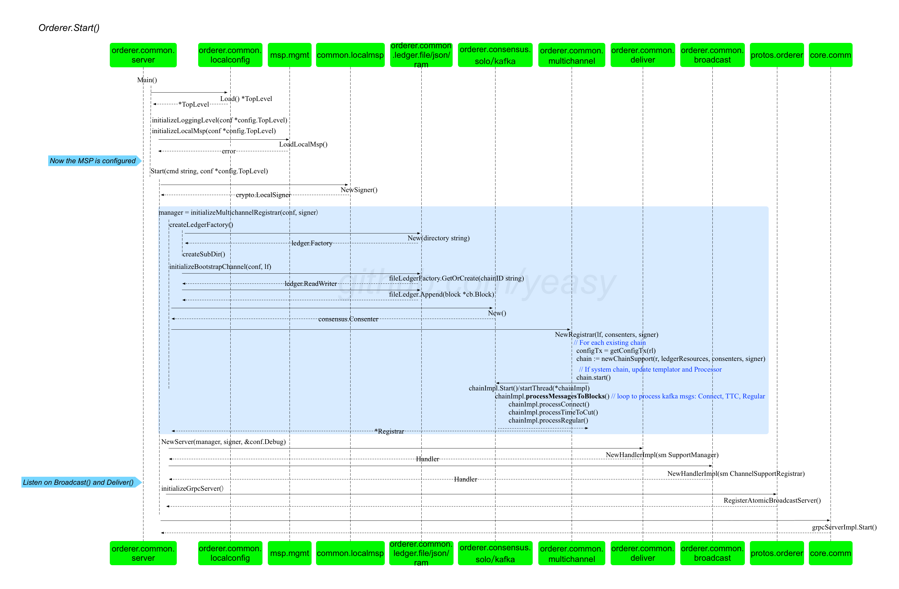

## Orderer 节点启动过程

Orderer 节点启动通过 `orderer` 包下的 main() 方法实现，会进一步调用到 `orderer/common/server` 包中的 `Main()` 方法。

核心代码如下所示。

```go
// Main is the entry point of orderer process
func Main() {
	fullCmd := kingpin.MustParse(app.Parse(os.Args[1:]))

	// "version" command
	if fullCmd == version.FullCommand() {
		fmt.Println(metadata.GetVersionInfo())
		return
	}

	conf := config.Load()
	initializeLoggingLevel(conf)
	initializeLocalMsp(conf)

	Start(fullCmd, conf)
}
```

包括配置初始化过程和核心启动过程两个部分：

* config.Load()：从本地配置文件和环境变量中读取配置信息，构建配置树结构。
* initializeLoggingLevel(conf)：配置日志级别。
* initializeLocalMsp(conf)：配置 MSP 结构。
* Start()：完成启动后的核心工作。

### 整体过程

核心启动过程都在 `orderer/common/server`包中的 Start() 方法，如下图所示。



Start() 方法会初始化 gRPC 服务需要的结构，然后启动服务。

核心代码如下所示。

```go
func Start(cmd string, conf *config.TopLevel) {
	logger.Debugf("Start()")
	signer := localmsp.NewSigner()
	manager := initializeMultichannelRegistrar(conf, signer)
	server := NewServer(manager, signer, &conf.Debug)

	switch cmd {
	case start.FullCommand(): // "start" command
		logger.Infof("Starting %s", metadata.GetVersionInfo())
		initializeProfilingService(conf)
		grpcServer := initializeGrpcServer(conf)
		ab.RegisterAtomicBroadcastServer(grpcServer.Server(), server)
		logger.Info("Beginning to serve requests")
		grpcServer.Start()
	case benchmark.FullCommand(): // "benchmark" command
		logger.Info("Starting orderer in benchmark mode")
		benchmarkServer := performance.GetBenchmarkServer()
		benchmarkServer.RegisterService(server)
		benchmarkServer.Start()
	}
}
```

包括两大部分：

* gRPC 服务结构初始化；
* gRPC 服务启动。


### gRPC 服务结构初始化

包括创建新的 MSP 签名结构，初始化 Registrar 结构来管理各个账本结构，启动共识过程，以及创建 gRPC 服务端结构。

核心步骤包括：

```go
signer := localmsp.NewSigner() // 初始化签名结构
manager := initializeMultichannelRegistrar(conf, signer, tlsCallback) // 初始化账本管理器（Registrar）结构
```

其中，`initializeMultichannelRegistrar(conf, signer)` 方法最为关键，核心代码如下：

```go
func initializeMultichannelRegistrar(conf *config.TopLevel, signer crypto.LocalSigner, callbacks ...func(bundle *channelconfig.Bundle)) *multichannel.Registrar {
	// 创建操作账本的工厂结构
	lf, _ := createLedgerFactory(conf)
	
	// 如果是首次启动情况，默认先创建系统通道的本地账本结构
	if len(lf.ChainIDs()) == 0 {
		logger.Debugf("There is no chain, hence we must be in bootstrapping")
		initializeBootstrapChannel(conf, lf)
	} else {
		logger.Info("Not bootstrapping because of existing chains")
	}
	//初始化共识插件，共识插件负责跟后台的队列打交道
	consenters := make(map[string]consensus.Consenter)
	consenters["solo"] = solo.New()
	consenters["kafka"] = kafka.New(conf.Kafka.TLS, conf.Kafka.Retry, conf.Kafka.Version, conf.Kafka.Verbose)

	// 创建各个账本的管理器（Registrar）结构，并启动共识过程
	return multichannel.NewRegistrar(lf, consenters, signer, callbacks...)
}
```

利用传入的配置信息和签名信息完成如下步骤：

* 创建账本操作的工厂结构；
* 如果是新启动情况，利用给定的系统初始区块文件初始化系统通道的相关结构；
* 完成共识插件（包括 `solo` 和 `kafka` 两种）的初始化；
* `multichannel.NewRegistrar(lf, consenters, signer)`
方法会扫描本地账本数据（此时至少已存在系统通道），创建 Registrar 结构，并为每个账本都启动共识（如 Kafka 排序）过程。

*说明：Registrar 结构（位于 `orderer.common.multichannel` 包）是 Orderer 组件中最核心的结构，管理了 Orderer 中所有的账本、共识插件等数据结构。*


#### 创建 Registrar 结构并启动共识过程

`NewRegistrar(lf, consenters, signer)` 方法位于 `orderer.common.multichannel` 包，负责初始化链支持、消息处理器等重要数据结构，并为各个账本启动共识过程。

核心代码如下：

```go
existingChains := ledgerFactory.ChainIDs()
for _, chainID := range existingChains { // 启动本地所有的账本结构的共识过程
	if _, ok := ledgerResources.ConsortiumsConfig(); ok { // 如果是系统账本（默认在首次启动时会自动创建）
		chain := newChainSupport(r, ledgerResources, consenters, signer)
		chain.Processor = msgprocessor.NewSystemChannel(chain, r.templator, msgprocessor.CreateSystemChannelFilters(r, chain))
		r.chains[chainID] = chain
		r.systemChannelID = chainID
		r.systemChannel = chain
		defer chain.start() // 启动共识过程
	else // 如果是应用账本
		chain := newChainSupport(r, ledgerResources, consenters, signer)
		r.chains[chainID] = chain
		chain.start()  // 启动共识过程
	}
```

`chain.start()` 方法负责启动共识过程。以 Kafka 共识插件为例，最终以协程方式调用到 `orderer.consensus.kafka` 包中的 `startThread()` 方法，将在后台持续运行。

```go
func (chain *chainImpl) Start() {
	go startThread(chain)
}
```

`startThread()` 方法将为指定的账本结构配置共识服务，并将其启动，核心代码包括：

```go
// 创建 Producer 结构
chain.producer, err = setupProducerForChannel(chain.consenter.retryOptions(), chain.haltChan, chain.SharedConfig().KafkaBrokers(), chain.consenter.brokerConfig(), chain.channel)
// 发送 CONNECT 消息给 Kafka，如果失败，则退出
sendConnectMessage(chain.consenter.retryOptions(), chain.haltChan, chain.producer, chain.channel)

// 创建处理对应 Kafka topic 的 Consumer 结构
chain.parentConsumer, err = setupParentConsumerForChannel(chain.consenter.retryOptions(), chain.haltChan, chain.SharedConfig().KafkaBrokers(), chain.consenter.brokerConfig(), chain.channel)
// 配置从指定 partition 读取消息的 PartitionConsumer 结构
chain.channelConsumer, err = setupChannelConsumerForChannel(chain.consenter.retryOptions(), chain.haltChan, chain.parentConsumer, chain.channel, chain.lastOffsetPersisted+1)

// 从该链对应的 Kafka 分区不断读取消息，并进行处理过程
chain.processMessagesToBlocks() 
```

主要包括如下步骤：

* 创建到 Kafka 集群的 Producer 结构并发送 CONNECT 消息；
* 为对应的 topic 创建 Consumer 结构，并配置从指定分区读取消息的 PartitionConsumer 结构；
* 对链对应的 Kafka 分区中消息的进行循环处理。这部分更详细内容可以参考 [Orderer 节点对排序后消息的处理过程](https://github.com/yeasy/hyperledger_code_fabric/blob/master/process/orderer_consume_msg.md)。

### gRPC 服务启动

初始化 gRPC 服务结构，完成绑定并启动监听。

```go
// 初始化 gRPC 服务端结构
server := NewServer(manager, signer, &conf.Debug)

// 创建 gRPC 服务连接
grpcServer := initializeGrpcServer(conf)

// 绑定 gRPC 服务并启动
ab.RegisterAtomicBroadcastServer(grpcServer.Server(), server)
grpcServer.Start()
```

其中，`NewServer(manager, signer, &conf.Debug)` 方法（位于 `orderer.common.server` 包）最为核心，将 gRPC 相关的服务结构进行初始化，并绑定到 gRPC 请求上。分别响应 [Deliver()](https://github.com/yeasy/hyperledger_code_fabric/blob/master/process/orderer_deliver.md) 和 [Broadcast()](https://github.com/yeasy/hyperledger_code_fabric/blob/master/process/orderer_broadcast.md) 两个 gRPC 调用。

```go
// NewServer creates an ab.AtomicBroadcastServer based on the broadcast target and ledger Reader
func NewServer(r *multichannel.Registrar, _ crypto.LocalSigner, debug *localconfig.Debug) ab.AtomicBroadcastServer {
	s := &server{
		dh:    deliver.NewHandlerImpl(deliverSupport{Registrar: r}),
		bh:    broadcast.NewHandlerImpl(broadcastSupport{Registrar: r}),
		debug: debug,
	}
	return s
}
```

