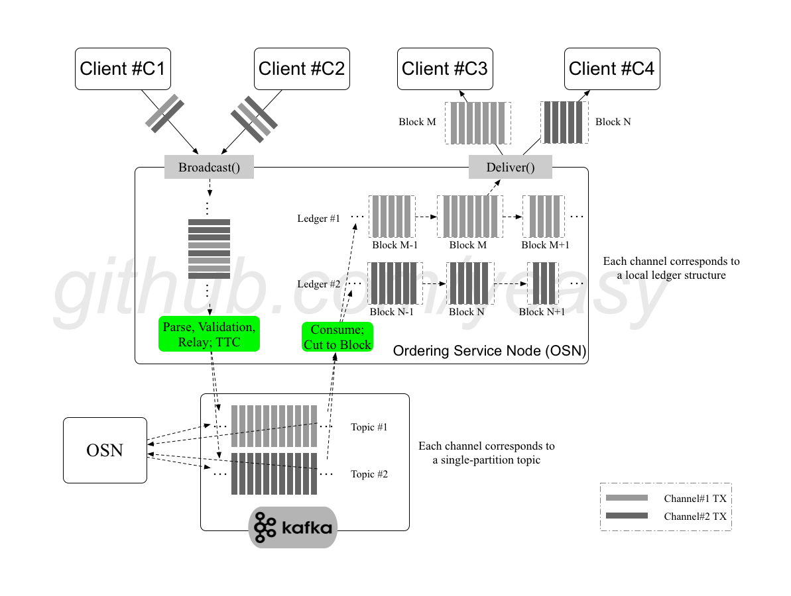

## 排序服务核心原理和工作过程

排序服务在超级账本 Fabric 网络中起到十分核心的作用。所有交易在发送给 Committer 进行验证接受之前，需要先经过排序服务进行全局排序。

在目前架构中，排序服务的功能被抽取出来，作为单独的 fabric-orderer 模块来实现，代码主要在 `fabric/orderer` 目录下。

下面以 Kafka 作为共识插件为例，讲解 Orderer 节点的核心过程。

### 工作原理

Orderer 节点（Ordering Service Node，OSN）在网络中起到代理作用，多个 Orderer 节点会连接到 Kafka 集群，利用 Kafka 的共识功能，完成对网络中交易的排序和打包成区块的工作。

Fabric 网络提供了多通道特性，为了支持这一特性，同时保障每个 Orderer 节点上数据的一致性，排序服务进行了一些特殊设计。

对于每个通道，Orderer 将其映射到 Kafka 集群中的一个 topic （topic 名称与 channelID 相同）上。由于 Orderer 目前并没有使用 Kafka Topic 的多分区负载均衡特性，默认每个 topic 只创建了一个分区（0 号分区）。

此外，Orderer 还在本地维护了针对每个通道的账本（区块链）结构，其中每个区块包括了一组排序后的交易消息，并且被分割为独立区块。

### 核心过程

核心过程如下所示。

* 客户端通过 gRPC 连接发送交易信息到 Orderer 节点的 `Broadcast()` 接口。
* Orderer 节点收到请求后，提取消息进行解析、检查，通过检查后封装为 Kafka 消息，通过 Produce 接口发送到 Kakfa 集群对应的 topic 分区中。
* 当超时时间达到 BatchTimeout，则发送分块消息 TTC-X 到 Kafka，其他的条件不会触发TTC-x信号

* Kafka 集群维护多个 topic 分区。Kakfa 通过共识算法来确保写入到分区后的消息的一致性。即一旦写入分区，任何 Orderer 节点看到的都是相同的消息队列。
* Orderer 节点在启动后，还默认对本地账本对应的 Kafka 分区数据进行监听，不断从 Kafka 拉取（Consume）新的交易消息，并对消息进行处理。满足一定策略情况下（收到 TTX-C 或配置消息）还会将消息打包为区块。

### 分块决策

收到分块消息 TTC-X，或收到配置交易，则切分之前从 Kafka 中收到的消息为区块，记录到本地账本结构中。

