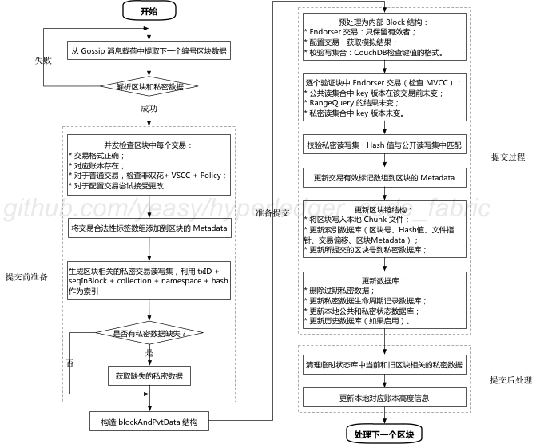

## Peer 提交区块过程

Peer 启动后会在后台执行 gossip 服务，包括若干 goroutine，实现位于 `gossip/state/state.go#NewGossipStateProvider(chainID string, services *ServicesMediator, ledger ledgerResources) GossipStateProvider` 方法。

其中一个协程专门负责处理收到的区块信息。

```go
// Deliver in order messages into the incoming channel
go s.deliverPayloads()
```

deliverPayloads() 方法实现位于同一个文件的 GossipStateProviderImpl 结构下，其主要过程为循环从收到的 Gossip 消息载荷缓冲区按序拿到封装消息，解析后进行处理。核心代码逻辑如下：

```go
// gossip/state/state.go#GossipStateProviderImpl.deliverPayloads()
for {
    select {
    case <-s.payloads.Ready(): // 等待消息
        // 依次处理收到的消息
        for payload := s.payloads.Pop(); payload != nil; payload = s.payloads.Pop() {
            rawBlock := &common.Block{}
            // 从载荷数据中尝试解析区块结构，失败则尝试下个消息
            if err := pb.Unmarshal(payload.Data, rawBlock); err != nil {
                logger.Errorf("Error getting block with seqNum = %d due to (%+v)...dropping block", payload.SeqNum, errors.WithStack(err))
                continue
            }
			// 检查区块结构是否完整，失败则尝试下个消息
            if rawBlock.Data == nil || rawBlock.Header == nil {
                logger.Errorf("Block with claimed sequence %d has no header (%v) or data (%v)",
                    payload.SeqNum, rawBlock.Header, rawBlock.Data)
                continue
            }

            // 从载荷中解析私密数据，失败则尝试下个消息
            var p util.PvtDataCollections
            if payload.PrivateData != nil {
                err := p.Unmarshal(payload.PrivateData)
                if err != nil {
                    logger.Errorf("Wasn't able to unmarshal private data for block seqNum = %d due to (%+v)...dropping block", payload.SeqNum, errors.WithStack(err))
                    continue
                }
            }
            // 核心部分：提交区块到本地账本
            if err := s.commitBlock(rawBlock, p); err != nil {
                if executionErr, isExecutionErr := err.(*vsccErrors.VSCCExecutionFailureError); isExecutionErr {
                    logger.Errorf("Failed executing VSCC due to %v. Aborting chain processing", executionErr)
                    return
                }
                logger.Panicf("Cannot commit block to the ledger due to %+v", errors.WithStack(err))
            }
        }
    case <-s.stopCh: // 停止处理消息
        s.stopCh <- struct{}{}
        logger.Debug("State provider has been stopped, finishing to push new blocks.")
        return
    }
}
```

### 整体逻辑

s.commitBlock(rawBlock, p) 是对区块进行处理和提交的核心逻辑，主要包括提交前准备、提交过程和提交后处理三部分，如下图所示。



下面分别进行介绍三个阶段的实现过程。

### 提交前准备

主要完成对区块中交易格式的检查和获取关联该区块但缺失的私密数据，最后构建 blockAndPvtData 结构。


#### 格式检查
对区块格式的检查主要在 `core/committer/txvalidator/validator.go#TxValidator.Validate(block *common.Block) error` 方法中完成，包括检查交易格式、对应账本是否存在、是否双花、满足 VSCC 和 Policy 等。核心逻辑如下。

```go
// core/committer/txvalidator/validator.go#TxValidator.Validate(block *common.Block) error
// 并发验证交易有效性
go func() {
    for tIdx, d := range block.Data.Data {
        // ensure that we don't have too many concurrent validation workers
        v.Support.Acquire(context.Background(), 1)

        go func(index int, data []byte) {
            defer v.Support.Release(1)

            v.validateTx(&blockValidationRequest{
                d:     data,
                block: block,
                tIdx:  index,
            }, results)
        }(tIdx, d)
    }
}()


// 处理检查结果
for i := 0; i < len(block.Data.Data); i++ {
    res := <-results

    if res.err != nil {
        if err == nil || res.tIdx < errPos {
            err = res.err
            errPos = res.tIdx
        }
    } else { // 设置有效标记，记录链码名称，更新链码信息
        txsfltr.SetFlag(res.tIdx, res.validationCode)

        if res.validationCode == peer.TxValidationCode_VALID {
            if res.txsChaincodeName != nil {
                txsChaincodeNames[res.tIdx] = res.txsChaincodeName
            }
            if res.txsUpgradedChaincode != nil {
                txsUpgradedChaincodes[res.tIdx] = res.txsUpgradedChaincode
            }
            txidArray[res.tIdx] = res.txid
        }
    }
}

// 标记双花交易
if v.Support.Capabilities().ForbidDuplicateTXIdInBlock() {
    markTXIdDuplicates(txidArray, txsfltr)
}

// 防止多次升级操作
v.invalidTXsForUpgradeCC(txsChaincodeNames, txsUpgradedChaincodes, txsfltr)

// 确认所有交易都完成检查
err = v.allValidated(txsfltr, block)
if err != nil {
    return err
}

// 更新交易有效标签到元数据
utils.InitBlockMetadata(block)
block.Metadata.Metadata[common.BlockMetadataIndex_TRANSACTIONS_FILTER] = txsflt
```

#### 获取缺失的私密数据

首先根据已有的私密数据计算区块中交易关联的读写集信息。如果仍有缺失，则尝试从其它节点获取。

```go
// gossip/privdata/coordinator.go#coordinator.StoreBlock(block *common.Block, privateDataSets util.PvtDataCollections) error
// 利用已有的私密数据计算读写集
ownedRWsets, err := computeOwnedRWsets(block, privateDataSets)
privateInfo, err := c.listMissingPrivateData(block, ownedRWsets)

// 获取缺失私密数据
for len(privateInfo.missingKeys) > 0 && time.Now().Before(limit) {
    c.fetchFromPeers(block.Header.Number, ownedRWsets, privateInfo)
    if len(privateInfo.missingKeys) == 0 {
        break
    }
    time.Sleep(pullRetrySleepInterval)
}
```

#### 构建 blockAndPvtData 结构

blockAndPvtData 结构用于后续的提交工作，因此，需要包括相关的区块和私密数据。

主要实现逻辑如下：

```go
// gossip/privdata/coordinator.go#coordinator.StoreBlock(block *common.Block, privateDataSets util.PvtDataCollections) error
// 填充私密读写集信息
for seqInBlock, nsRWS := range ownedRWsets.bySeqsInBlock() {
    rwsets := nsRWS.toRWSet()
    blockAndPvtData.BlockPvtData[seqInBlock] = &ledger.TxPvtData{
        SeqInBlock: seqInBlock,
        WriteSet:   rwsets,
    }
}

// 填充缺失私密数据信息
for missingRWS := range privateInfo.missingKeys {
    blockAndPvtData.Missing = append(blockAndPvtData.Missing, ledger.MissingPrivateData{
        TxId:       missingRWS.txID,
        Namespace:  missingRWS.namespace,
        Collection: missingRWS.collection,
        SeqInBlock: int(missingRWS.seqInBlock),
    })
}
```


### 提交过程

提交过程是核心过程，主要包括预处理、验证交易、更新本地区块链结构、更新本地数据库结构四个步骤。

#### 预处理

预处理阶段负责构造一个有效的内部区块结构。包括：

* 处理 Endorser 交易：只保留有效的 Endorser 交易；
* 处理配置交易：获取配置更新的模拟结果，放入读写集；
* 校验写集合：如果状态数据库采用 CouchDB，要按照 CouchDB 约束检查键值的格式：Key 必须为非下划线开头的 UTF-8 字符串，Value 必须为合法的字典结构，且不包括下划线开头的键名。

核心实现代码位于 core/ledger/kvledger/txmgmt/validator/valimpl/helper.go#preprocessProtoBlock(txmgr txmgr.TxMgr, validateKVFunc func(key string, value []byte) error, block *common.Block, doMVCCValidation bool) (*valinternal.Block, error)，如下所示：

```go
// core/ledger/kvledger/txmgmt/validator/valimpl/helper.go#preprocessProtoBlock(txmgr txmgr.TxMgr, validateKVFunc func(key string, value []byte) error, block *common.Block, doMVCCValidation bool) (*valinternal.Block, error)
// 处理 endorser 交易
if txType == common.HeaderType_ENDORSER_TRANSACTION {
    // extract actions from the envelope message
    respPayload, err := utils.GetActionFromEnvelope(envBytes)
    if err != nil {
        txsFilter.SetFlag(txIndex, peer.TxValidationCode_NIL_TXACTION)
        continue
    }
    txRWSet = &rwsetutil.TxRwSet{}
    if err = txRWSet.FromProtoBytes(respPayload.Results); err != nil {
        txsFilter.SetFlag(txIndex, peer.TxValidationCode_INVALID_OTHER_REASON)
        continue
    }
} else { // 处理配置更新交易
    rwsetProto, err := processNonEndorserTx(env, chdr.TxId, txType, txmgr, !doMVCCValidation)
    if _, ok := err.(*customtx.InvalidTxError); ok {
        txsFilter.SetFlag(txIndex, peer.TxValidationCode_INVALID_OTHER_REASON)
        continue
    }
    if err != nil {
        return nil, err
    }
    if rwsetProto != nil {
        if txRWSet, err = rwsetutil.TxRwSetFromProtoMsg(rwsetProto); err != nil {
            return nil, err
        }
    }
}
// 检查读写集是否符合数据库要求格式
if txRWSet != nil {
    if err := validateWriteset(txRWSet, validateKVFunc); err != nil {
        txsFilter.SetFlag(txIndex, peer.TxValidationCode_INVALID_WRITESET)
        continue
    }
    b.Txs = append(b.Txs, &valinternal.Transaction{IndexInBlock: txIndex, ID: chdr.TxId, RWSet: txRWSet})
}
```

#### 验证交易

接下来，对区块中交易进行 MVCC 检查，并校验私密读写集，更新区块元数据中的交易有效标记列表。

MVCC 检查需要逐个验证块中的 Endorser 交易，满足下列条件者才认为有效：

* 公共读集合中 key 版本在该交易前未变；
* RangeQuery 的结果未变；
* 私密读集合中 key 版本未变。

实现在 core/ledger/kvledger/txmgmt/validator/statebasedval/state_based_validator.go#Validator.ValidateAndPrepareBatch(block *valinternal.Block, doMVCCValidation bool) (*valinternal.PubAndHashUpdates, error) 方法中，主要逻辑如下：

```go
// core/ledger/kvledger/txmgmt/validator/statebasedval/state_based_validator.go#Validator.ValidateAndPrepareBatch(block *valinternal.Block, doMVCCValidation bool) (*valinternal.PubAndHashUpdates, error)

// 依次顺序检查每个交易
for _, tx := range block.Txs {
    var validationCode peer.TxValidationCode
    var err error
    // 检查 Endorser 交易
    if validationCode, err = v.validateEndorserTX(tx.RWSet, doMVCCValidation, updates); err != nil {
        return nil, err
    }

    tx.ValidationCode = validationCode
    // 有效交易则将其读写集放到更新集合中
    if validationCode == peer.TxValidationCode_VALID {
        committingTxHeight := version.NewHeight(block.Num, uint64(tx.IndexInBlock))
        updates.ApplyWriteSet(tx.RWSet, committingTxHeight)
    } else {
        logger.Warningf("Block [%d] Transaction index [%d] TxId [%s] marked as invalid by state validator. Reason code [%s]",
            block.Num, tx.IndexInBlock, tx.ID, validationCode.String())
    }
}
```

对私密读写集的校验主要是再次检查 Hash 值是否匹配，实现在 `core/ledger/kvledger/txmgmt/validator/valimpl/helper.go#validatePvtdata(tx *valinternal.Transaction, pvtdata *ledger.TxPvtData) error` 方法中。

```go
// core/ledger/kvledger/txmgmt/validator/valimpl/helper.go#validatePvtdata(tx *valinternal.Transaction, pvtdata *ledger.TxPvtData) error
for _, nsPvtdata := range pvtdata.WriteSet.NsPvtRwset {
    for _, collPvtdata := range nsPvtdata.CollectionPvtRwset {
        collPvtdataHash := util.ComputeHash(collPvtdata.Rwset)
        hashInPubdata := tx.RetrieveHash(nsPvtdata.Namespace, collPvtdata.CollectionName)
        // 重新计算私密数据 Hash 值，对比公共数据中的记录
        if !bytes.Equal(collPvtdataHash, hashInPubdata) {
            return &validator.ErrPvtdataHashMissmatch{
                Msg: fmt.Sprintf(`Hash of pvt data for collection [%s:%s] does not match with the corresponding hash in the public data.
                public hash = [%#v], pvt data hash = [%#v]`, nsPvtdata.Namespace, collPvtdata.CollectionName, hashInPubdata, collPvtdataHash),
            }
        }
    }
}
```

最后，更新区块元数据中的交易有效标记列表，实现位于 `core/ledger/kvledger/txmgmt/validator/valimpl/helper.go#postprocessProtoBlock(block *common.Block, validatedBlock *valinternal.Block)` 方法，代码如下所示。

```go
// core/ledger/kvledger/txmgmt/validator/valimpl/helper.go#postprocessProtoBlock(block *common.Block, validatedBlock *valinternal.Block)
func postprocessProtoBlock(block *common.Block, validatedBlock *valinternal.Block) {
	txsFilter := util.TxValidationFlags(block.Metadata.Metadata[common.BlockMetadataIndex_TRANSACTIONS_FILTER])
	for _, tx := range validatedBlock.Txs {
		txsFilter.SetFlag(tx.IndexInBlock, tx.ValidationCode)
	}
	block.Metadata.Metadata[common.BlockMetadataIndex_TRANSACTIONS_FILTER] = txsFilter
}
```

接下来，需要更新本地的账本结构，包括区块链结构和相关的本地数据库。

#### 更新本地区块链结构

入口在 `core/ledger/ledgerstorage/store.go#Store.CommitWithPvtData(blockAndPvtdata *ledger.BlockAndPvtData) error` 方法中，主要包括如下步骤：

* 将区块写入本地 Chunk 文件；
* 更新索引数据库（区块号、Hash值、文件指针、交易偏移、区块元数据）；
* 更新所提交的区块号到私密数据库；

区块写入 Chunk 文件主要实现在 `common/ledger/blkstorage/fsblkstorage/blockfile_mgr.go#blockfileMgr.addBlock(block *common.Block) error` 方法中，主要逻辑如下所示：

```go
// common/ledger/blkstorage/fsblkstorage/blockfile_mgr.go#blockfileMgr.addBlock(block *common.Block) error
// 计算长度信息
blockBytesLen := len(blockBytes)
blockBytesEncodedLen := proto.EncodeVarint(uint64(blockBytesLen))
totalBytesToAppend := blockBytesLen + len(blockBytesEncodedLen)

// 添加长度信息到 Chunk 文件
err = mgr.currentFileWriter.append(blockBytesEncodedLen, false)

// 更新 checkpoint 信息
newCPInfo := &checkpointInfo{
	latestFileChunkSuffixNum: currentCPInfo.latestFileChunkSuffixNum,
	latestFileChunksize:      currentCPInfo.latestFileChunksize + totalBytesToAppend,
	isChainEmpty:             false,
	lastBlockNumber:          block.Header.Number}
mgr.saveCurrentInfo(newCPInfo, false);

// 更新区块在文件中索引位置和交易偏移量
blockFLP := &fileLocPointer{fileSuffixNum: newCPInfo.latestFileChunkSuffixNum}
	blockFLP.offset = currentOffset
for _, txOffset := range txOffsets {
		txOffset.loc.offset += len(blockBytesEncodedLen)
}

// 更新索引数据库
mgr.index.indexBlock(&blockIdxInfo{
	blockNum: block.Header.Number, blockHash: blockHash,
	flp: blockFLP, txOffsets: txOffsets, metadata: block.Metadata})

// 更新 checkpoint 信息和区块链信息
mgr.updateCheckpoint(newCPInfo)
mgr.updateBlockchainInfo(blockHash, block)
```

#### 更新本地数据库结构
更新数据库是提交交易的最后一步，主要包括如下步骤：

* 删除过期私密数据；
* 更新私密数据生命周期记录数据库；
* 更新本地公共状态数据库和私密状态数据库；
* 如果启用了历史数据库，更新数据。

实现代码在 `core/ledger/kvledger/txmgmt/txmgr/lockbasedtxmgr/lockbased_txmgr.go#LockBasedTxMgr.Commit() error` 方法中，主要逻辑如下。

```go
// core/ledger/kvledger/txmgmt/txmgr/lockbasedtxmgr/lockbased_txmgr.go#LockBasedTxMgr.Commit() error

// 准备过期的私密键值清理
txmgr.pvtdataPurgeMgr.PrepareForExpiringKeys(txmgr.current.blockNum())

// 更新私密数据生命周期记录数据库，这里记录了每个私密键值的存活期限
if err := txmgr.pvtdataPurgeMgr.DeleteExpiredAndUpdateBookkeeping(
		txmgr.current.batch.PvtUpdates, txmgr.current.batch.HashUpdates); err != nil{
	return err
}

// 更新本地公共状态数据库和私密状态数据库
if err := txmgr.db.ApplyPrivacyAwareUpdates(txmgr.current.batch, commitHeight); err != nil {
	return err
}

// 如果启用了历史数据库，更新数据
if ledgerconfig.IsHistoryDBEnabled() {
	if err := l.historyDB.Commit(block); err != nil {
		panic(errors.WithMessage(err, "Error during commit to history db"))
	}
}
```

### 提交后处理

提交后的处理比较简单，包括清理本地的临时状态数据库和更新账本高度信息。

清理工作包括区块关联的临时私密数据和旧区块关联的临时私密数据。
