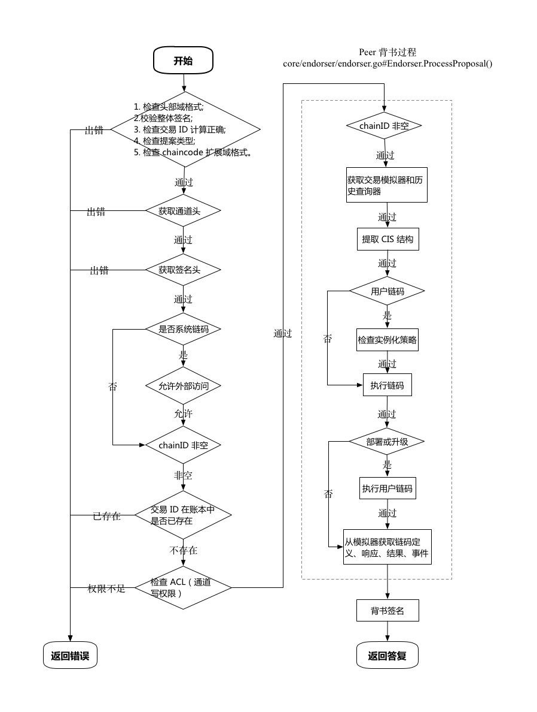

## Peer 背书提案过程

客户端将交易预提案（Transaction Proposal)通过 gRPC 发送给支持 Endorser 角色的 Peer 进行背书。

这些交易提案可能包括链码的安装、实例化、升级、调用、查询；以及 Peer 节点加入和列出通道操作。

Peer 接收到请求后，会调用 `core/endorser/Endorser` 结构体的 `ProcessProposal(ctx context.Context, signedProp *pb.SignedProposal) (*pb.ProposalResponse, error)` 方法，进行具体的背书处理。

背书过程主要完成如下操作：

* 检查提案消息的合法性，以及相关的权限；
* 模拟执行提案：启动链码容器，对世界状态的最新版本进行临时快照，基于它执行链码，将结果记录在读写集中；
* 对提案内容和读写集合进行签名，并返回提案响应消息。

### 整体过程

主要过程如下图所示。

* 检查提案合法性，主要由 `preProcess(signedProp *pb.SignedProposal) (*validateResult, error)` 方法完成；
    * 调用 ValidateProposalMessage() 方法对签名的提案进行格式检查，主要包括：
        * Channel 头部格式：是否合法头部类型，由 validateChannelHeader() 完成；
        * 签名头格式：是否包括了 nonce 和creators 数据，由 validateSignatureHeader() 完成；
        * 签名域：creator 证书 MSP 检查是否合法，签名是否正确，由 checkSignatureFromCreator() 完成。
    * 如果是系统链码调用（SCC），检查是否是允许从外部调用的三种 SCC 之一：cscc、lscc、qscc 或 rscc；
    * 如果 chainID 不为空，获取对应 chain 的账本结构，并检查 TxID 唯一性，确保同一交易未曾提交到账本结构中；
    * 对于用户链码调用，需要检查 ACL：资源为 `PROPOSE`，默认策略是签名提案者在通道上拥有写权限（`CHANNELWRITERS`）。
* 模拟执行提案
    * 如果 chainID 不为空，获取对应账本的交易模拟器（TxSimulator）和历史查询器（HistoryQueryExecutor），这两个结构将在后续执行链码时被使用。
    * 如果 chainID 不为空，调用 `simulateProposal()` 方法获取模拟执行的结果，检查返回的响应 response 的状态，若不小于错误 500 则创建并返回一个失败的 ProposalResponse。
* 对提案内容和读写集合进行签名
    * chainID 非空情况下，调用 endorseProposal() 方法利用 ESCC，对之前得到的模拟执行的结果进行背书。返回 ProposalResponse，检查 simulateProposal 返回的response 的状态，若不小于错误阈值 400（被背书节点反对），返回 ProposalResponse 及链码错误 chaincodeError（endorseProposal 里有检查链码执行结果的状态，而 simulateProposal 没有检查）。
    * 将 response.Payload 赋给 ProposalResponse.Response.Payload（因为 simulateProposal 返回的 response 里面包含链码调用的结果）。
    * 返回响应消息 ProposalResponse。

#### simulateProposal 方法

simulateProposal 方法会通过执行链码逻辑来获取对状态的修改结果，并存放到读写集合中，主要过程如下：

* 从提案结构的载荷中提取 ChaincodeInvocationSpec 结构，其中包含了所调用链码（包括系统链码和用户链码）的路径、名称和版本，以及调用时传入的参数列表；
* 检查 ESCC 和 VSCC（尚未实现）；
* 对用户链码，检查提案中的实例化策略跟账本上记录的该链码的实例化策略（安装链码时指定）是否一致。防止有人修改权限在其它通道非法实例化。
* 调用 callChaincode() 方法执行 Proposal，返回 Response 和 ChaincodeEvent。
    * 调用 `core.endorser` 包中 `SupportImpl.Execute()` 方法，该方法主要调用 `core.chaincode` 包中的 `ExecuteChaincode()` 方法，进一步调用包内的 `Execute()` 方法。调用过程中会把交易模拟器和历史查询器通过上下文结构体传入后续子方法。
    * `Execute()` 方法会调用 `ChaincodeSupport.Launch()` 方法创建并启动链码容器。启动成功后创建链码 gRPC 消息，通过 `ChaincodeSupport.Execute()` 方法发送消息给 CC 容器，执行相关的合约，并返回执行响应（ChaincodeMessage 结构）。此过程中会将读写集记录到交易模拟器结构体中。
* 对于非空 chainID（大部分跟账本相关的操作），执行 GetTxSimulationResults() 拿到执行结果 `TxSimulationResults` 结构，从中可以解析出读写集数据。
* 最终返回链码标准数据结构 ChaincodeDefinition、响应消息 ChaincodeMessage、交易读写集 PubSimulationResults、链码事件 ChaincodeEvent。

#### endorseProposal 方法

主要过程如下：

* 获取被调用的链码指定的背书链码的名字。
* 通过 callChaincode() 实现对背书链码的调用，返回响应 response（对 ESCC 的调用同样也会产生 simulation results，但 ESCC 不能背书自己产生的simulation results，需要背书最初被调用的链码产生的 simulation results）。
* 检查 response.Status，是否大于等于 400（错误阈值），若是则把 response 赋给 proposalResponse.Response 并返回 proposalResponse。
* 将 response.Payload解码后（ProposalResponse类型）返回。

#### callChaincode 方法

主要过程如下：

* 判断交易模拟器，不为空则把它加入到Context的K-V存储中。
* 判断被call的cc是不是系统链码，创建CCContext（包含通道名、链码名、版本号、交易ID、是否 SCC、签名 Prop、Prop）
* 调用 core/chaincode/chaincodeexec.go 下的 ExecuteChaincode()，返回响应 response 和 事件ccevent。
* 返回 response和ccevent。

