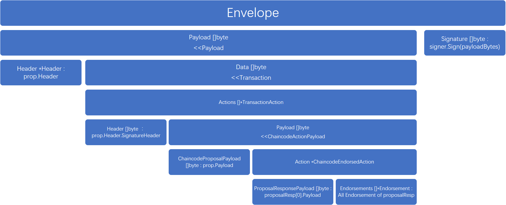

### txutils.go

#### CreateSignedTx(proposal, signer, resps)

* 按照下图的结构封装交易（其中有很重要的一步是按字节比对所有的`ProposalResponse.Payload`是否相等，处理多个Endorser情况下出现模拟结果不一样的问题，直接返回nil）。

Ps. 传入的resps是一个`ProposalResponse`的数组。

